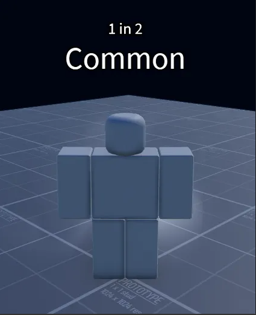
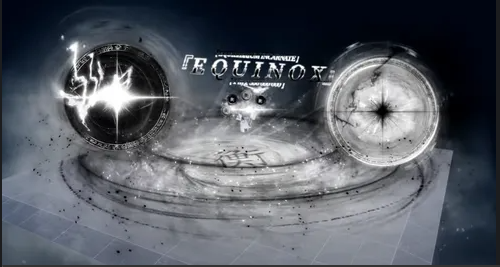

# 아우라

 아우라는 Sol's RNG의 주요 시스템으로 하단의 roll 버튼을 눌러 뽑을 수 있고 더욱 희귀한 아우라일수록 화려합니다.

  

 아우라는 2048, 노멀, 돌파(바이옴에서 뜨는것), 제작, 변이, 변이-돌파, 특수, 한정판, 기타의 종류로 나누어집니다.

## 2048 아우라
2048아우라는 확률이 2의 거듭제곱인 아우라를 말합니다

### 1~999
### 1,000~9,999
### 10,000~999,999
###  ▣ PIXELATION ▣(1,073,741,824)