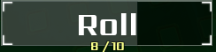
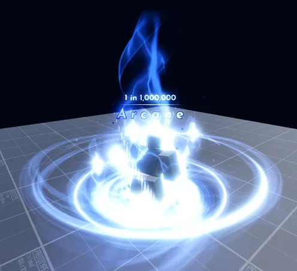
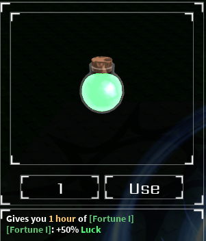

# 게임 소개

## sol's rng는 어떻게 하는 게임인가?

sols rng는 로블록스 게임으로 화면 하단의 roll을 눌러 아우라를 뽑는 게임입니다.

특징으론 아우라의 확률이 굉장히 낮다는 점이 있습니다.

또한, 아이템을 사용하여 운(luck)을 올려 확률을 높일 수 있습니다. 

이외에도, 여러 시스템이 있습니다.(이에 대해선 후술할 예정)